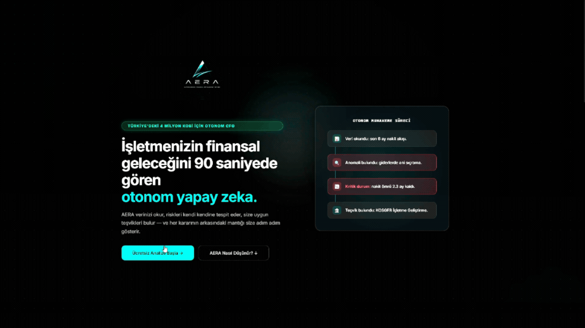
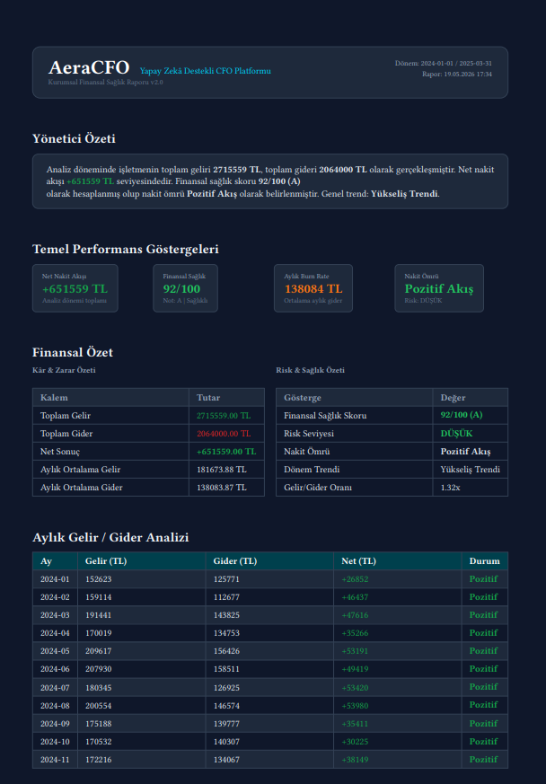

<div align="center">

# AeraCFO

### Otonom Yapay Zekâ CFO Platformu — KOBİ'ler için

CSV veya XLSX yükle → 3 ajanlı pipeline (Planner → Executor → Critic) Holt projeksiyonu, %90 güven aralığı, sektör benchmark ve KOSGEB/TÜBİTAK teşvik eşlemesini birkaç saniyede üretir. Çıktı: kurumsal A4 PDF.




</div>


---

## 30 Saniyede AeraCFO

| | |
|---|---|
| **Sorun** | KOBİ'ler için tam zamanlı CFO 40K TL+/ay; mali müşavir tabloyu okur ama strateji üretmez. Erişilebilir, otonom karar destek aracı yok. |
| **Çözüm** | 10 finansal Function-Tool (`analyze_cash_flow`, `predict_cashflow`, `simulate_scenario`, `search_incentives` …) ve 3 ajanlı planlama-yürütme-eleştiri zinciri ile veriyi yorumlayan yapay zekâ CFO. |
| **Stack** | Rust + Axum + Polars (Pandas/LangChain yok) → düşük bellek, deterministik gecikme, memory-safe. |
| **Hazır veri** | 23 sektör için statik demo CSV + her seferinde tohumla yeniden üreten `data_generator`. |

---

## Mimari — Katmanlı (Clean Architecture)

```
┌──────────────────────────────────────────────────────────────────┐
│  FRONTEND  ───  Tek-dosya React SPA · Mobile-first · ARIA · offline vendor│
│  frontend/index.html + app.js                                    │
                               │ HTTP/JSON
┌──────────────────────────────▼───────────────────────────────────┐

│  API LAYER  ───  Axum 0.7 · CORS · 10 MB body limit · IP rate-limit│
│  • POST /api/chat            (3-agent pipeline)                  │
│  • POST /api/upload/csv      (Polars parse + monthly cache)      │
│  • POST /api/upload/xlsx     (Calamine ile Excel import)         │
│  • GET  /api/demo            (statik veya canlı üretim)          │
│  • GET  /api/export/pdf      (Typst kurumsal rapor)              │
│  • GET  /health              (active_sessions)                   │
└──────────────────────────────┬───────────────────────────────────┘
                               │ DashMap<Session, Mutex<Orch>>
┌──────────────────────────────▼───────────────────────────────────┐
│  AGENTS LAYER  ───  Coordinator (Planner → Executor → Critic)    │
│  • planner.rs   → strateji + 1-4 alt görev + önerilen tool'lar   │
│  • orchestrator.rs (Executor) → 6 turlu Gemini function-calling  │
│  • critic.rs    → PASS / REVISE doğrulaması                      │
│  • Tüm ajanlar tek GeminiClient'ı paylaşır (pool + retry ortak)  │
└──────────────────────────────┬───────────────────────────────────┘
                               │
┌──────────────────────────────▼───────────────────────────────────┐
│  INFRASTRUCTURE                                                  │
│  • polars_engine.rs   → Holt α=0.3 β=0.1, Z-score (N-1),         │
│                          residual CI %90, monthly_cache          │
│  • gemini.rs          → reqwest reuse, 3× exp backoff retry,     │
│                          systemInstruction support               │
│  • incentives_db.rs   → 24 program (JSON), IDF-ağırlıklı search  │
│  • data_generator.rs  → 23 sektör profili, seed'li RNG           │
└──────────────────────────────────────────────────────────────────┘
```

---

## Özellikler

<table>
<tr>
<td width="50%">

### Otonom 3-Ajan Pipeline
- **Planner** — sorudan strateji + alt görevler çıkarır
- **Executor** — 10 Function-Tool ile 6 tura kadar agentic döngü
- **Critic** — yanıtı PASS/REVISE olarak doğrular
- Gemini hatasında **Planner/Critic fallback** ile kullanıcıyı kırmaz
- Son 20 + ilk mesaj kuralıyla **history trim**

</td>
<td width="50%">

### Finansal Analitik Motor
- **Holt Çift Üstel Düzeltme** (α=0.3, β=0.1)
- **Residual-Based %90 CI** — `margin = 1.64 · σ · √h`
- **Z-Score Anomali** — örnek std (N-1)
- **AeraCFO Finansal Sağlık Skoru** 0-100 composite (A/B/C/D harf notu)

</td>
</tr>
<tr>
<td>

### Güvenlik & Dayanıklılık
- **IP başına 30 req/dk** sliding window — UUID rotasyonuyla bypass edilemez
- **CSV Formula Injection** koruması (`=`, `+`, `@`, `-`)
- **x-goog-api-key** header (URL/erişim loglarına düşmez)
- **Session TTL** 30 dk + dakikalık cleanup task
- **Connection pool** (reqwest reuse) — TLS handshake elimine

</td>
<td>

### Veri Girişi & Çıkış
- **CSV + XLSX** import (Polars + Calamine)
- **23 sektör** için statik demo + canlı seed'li üretim
- **24 gerçek teşvik programı** — JSON-driven (`data/incentives.json`), **IDF-ağırlıklı retrieval**
- **Typst PDF** kurumsal rapor (`templates/report.typ`)

**Örnek Typst Raporu**



</td>
</tr>
</table>

---

## Hızlı Başlangıç

### 1. Gereksinimler
- **Rust** 1.75+ ([rustup.rs](https://rustup.rs))
- **Gemini API Key** ([Google AI Studio](https://aistudio.google.com/app/apikey))
- **Typst CLI** (PDF için, opsiyonel) — `cargo install typst-cli`

### 2. Kur ve Çalıştır
```bash
git clone <repo-url> && cd aera_cfo
cp .env.example .env
# .env: GEMINI_API_KEY=...

cargo run --release
# → http://localhost:3000
```

### 3. Demo Akışı
```text
1. Tarayıcıdan http://localhost:3000 aç
2. Sol panelden bir sektör demo'su seç (örn. "Restoran")
3. Sohbete: "Proaktif analiz et" → 6 sn'de dashboard + teşvik kartları
4. PDF butonu → kurumsal raporun indirilir
```

### 4. Docker ile Çalıştır (önerilen)

Rust toolchain ve Typst kurmak istemiyorsan Docker yeterli:

```bash
echo "GEMINI_API_KEY=sk-..." > .env
docker compose up --build
# → http://localhost:3000
```

Veya `compose` olmadan elle:
```bash
docker build -t aeracfo .
docker run --rm -p 3000:3000 -e GEMINI_API_KEY=sk-... aeracfo
```

**Image içeriği:** `debian:bookworm-slim` üstüne sadece **binary + frontend + 23 demo CSV + Typst CLI + ca-certs**. OpenSSL yok (rustls), non-root user (`uid 10001`), `tini` PID 1, `/health` üzerinden Docker HEALTHCHECK. PDF endpoint'i kutudan çıkar çıkmaz çalışır.

---

## Yapılandırma (Environment Variables)

| Değişken | Varsayılan | Açıklama |
|---|---|---|
| `GEMINI_API_KEY` | _(zorunlu)_ | Gemini API anahtarı |
| `GEMINI_MODEL` | `gemini-2.5-flash` | Model override |
| `SERVER_ADDR` | `0.0.0.0:3000` | Bind adresi |
| `ALLOWED_ORIGINS` | `localhost` dev set | Prod CORS: `https://...,https://...` |
| `AERA_FRONTEND_DIR` | `frontend` | Static dosya dizini (Docker'da `/app/frontend`) |
| `TYPST_BIN` | `typst` (PATH'ten) | PDF binary tam yolu |
| `TRUST_PROXY_HEADERS` | `0` | `1` yaparsan rate-limit `X-Forwarded-For`'a güvenir |

---

## Algoritma Derinliği

### Holt Çift Üstel Düzeltme
```
level_t = α · y_t + (1-α) · (level_{t-1} + trend_{t-1})
trend_t = β · (level_t - level_{t-1}) + (1-β) · trend_{t-1}
forecast_{t+h} = level_t + h · trend_t
```
- **α=0.3** — seviye yumuşatma (responsive ama gürültüye karşı sağlam)
- **β=0.1** — trend yavaş adapte olur, kısa süreli yalpalamalar absorbe edilir
- **Holt-Winters tercih edilmedi** — KOBİ örneklemlerinde 12+ ay nadir, mevsimsel decomposition projeksiyonu bozar

### Residual-Based %90 Güven Aralığı
```
residual_t  = actual_net_t − fitted_net_t
σ           = sample_std(residuals)    // N-1, küçük örneklem dostu
margin_h    = 1.64 · σ · √h            // ufuk uzadıkça belirsizlik artar
CI          = [forecast_h − margin_h, forecast_h + margin_h]
```
> **Neden N-1?** KOBİ verileri genelde 6-24 ay. Popülasyon std (N) küçük örneklemde varyansı **olduğundan az** gösterir ve CI'yi sahte dar yapar.

### AeraCFO Finansal Sağlık Skoru (0-100)
| Bileşen | Puan | Hesap |
|---|---|---|
| **Nakit Güvenliği** | 0-40 | runway ≥12ay → 40, ≥6 → 32, ≥3 → 20, ≥1 → 8, <1 → 0 |
| **Gelir/Gider Oranı** | 0-35 | ratio ≥1.5 → 35, ≥1.2 → 27, ≥1.0 → 15, ≥0.8 → 7, <0.8 → 0 |
| **İstikrar** | 0-25 | 3+ ay veri → 25, 2 ay → 20, 1 ay → 10 |
| **Toplam** | 0-100 | A (≥80) · B (≥60) · C (≥40) · D (<40) |

---

## API Referansı

<details>
<summary><b>POST /api/chat</b> — 3-agent pipeline (Planner → Executor → Critic)</summary>

```http
POST /api/chat
Content-Type: application/json
X-API-Key: <gemini_key>          # opsiyonel — env fallback var

{
  "message": "Önümüzdeki 3 ay nakit akışım nasıl olur?",
  "session_id": "550e8400-e29b-..."   # opsiyonel — yoksa sunucu üretir
}
```
```json
{
  "reply": "Önümüzdeki 3 ayda... [AERA_METRICS]{...}[/AERA_METRICS][AERA_CASHFLOW]{...}[/AERA_CASHFLOW]",
  "tools_used": ["get_health_score", "predict_cashflow", "detect_cash_crunch"],
  "latency_ms": 1820,
  "session_id": "550e8400-...",
  "agent_trace": {
    "plan_strategy": "Forecast odaklı, sektör benchmark sonradan",
    "subtask_count": 2,
    "executor_tools": ["predict_cashflow", "detect_cash_crunch"],
    "critic_verdict": "PASS"
  }
}
```
</details>

<details>
<summary><b>POST /api/upload/csv</b> — CSV yükle, monthly cache hesapla</summary>

```http
POST /api/upload/csv?session_id=...&income_column=gelir&expense_column=gider&date_column=tarih
Content-Type: text/csv

tarih,gelir,gider,kategori
2026-01-01,100000,60000,Maaş
...
```
**Limitler:** 10 MB body, 100K satır, UTF-8. Formula-injection sütun adları reddedilir.
</details>

<details>
<summary><b>POST /api/upload/xlsx</b> — Excel (XLSX) içe aktarma</summary>

```http
POST /api/upload/xlsx?session_id=...
Content-Type: application/vnd.openxmlformats-officedocument.spreadsheetml.sheet
```
Calamine ile ilk sayfa parse edilir, CSV pipeline'ına devredilir. Aynı limitler geçerli.
</details>

<details>
<summary><b>GET /api/demo</b> — Statik veya canlı senaryo</summary>

```http
GET /api/demo?session_id=...&scenario=restoran
GET /api/demo?session_id=...&generate=true&sector=teknoloji_startup&pattern=growth&months=12
```
**Statik senaryolar (23):** `cafe`, `restoran`, `medikal`, `imalat`, `tekstil`, `lojistik`, `egitim_kursu`, `emlak`, `e_ticaret`, `gida_uretim`, `insaat`, `otomotiv_servis`, `perakende`, `saglik_klinik`, `teknoloji_startup`, `turizm`, `danismanlik`, `muhasebe_buro`, `ihracat`, `kobi`, `yazilim_ajans`, `kuafor_guzellik`, `eczane`

**Canlı üretim:** `generate=true` → her çağrı farklı seed, gerçekçi sektör profiline göre.
</details>

<details>
<summary><b>GET /api/export/pdf</b> — Kurumsal A4 rapor</summary>

```http
GET /api/export/pdf?session_id=...
```
**Çıktı:** `application/pdf` — KPI kartları, P&L tablosu, aylık döküm, KOSGEB önerisi.
**Bağımlılık:** Typst CLI (`TYPST_BIN` env veya PATH'te).
</details>

<details>
<summary><b>GET /health</b> — Liveness probe</summary>

```json
{
  "status": "operational",
  "version": "0.1.0",
  "engine": "Rust/Axum + Polars + Gemini 2.5 Flash",
  "active_sessions": 3
}
```
</details>

---

## 10 Function-Calling Aracı

| Tool | Ne yapar | Tetikleyici örnek |
|---|---|---|
| `analyze_cash_flow` | Burn rate, runway, risk seviyesi | "nakit akışım", "ne kadar dayanırım" |
| `get_health_score` | 0-100 composite skor | "sağlık skoru", "genel durum" |
| `predict_cashflow` | Holt + %90 CI projeksiyon | "gelecek ay", "3 ay sonra" |
| `simulate_scenario` | What-if analizi | "2 kişi işe alsam", "kira artsa" |
| `detect_anomalies` | Z-score son ay sapması | "anormal artış", "sıçrama" |
| `detect_cash_crunch` | Ardışık negatif tespit | "üst üste zarar", "krit. dönem" |
| `analyze_expense_categories` | Kategori payı + öneri | "harcamalar", "kategori" |
| `compare_sector_benchmark` | 8 sektör karşılaştırma | "sektör ortalaması" |
| `search_incentives` | 24 program · IDF retrieval | "teşvik", "hibe", "destek" |
| `get_data_summary` | Yüklü veri özeti | "hangi sütunlar" |

---

## Güvenlik Katmanları

| Vektör | Korunma |
|---|---|
| **API key sızıntısı** | `x-goog-api-key` header → HTTP log / CDN cache temiz |
| **CSV Formula Injection** | `=`, `+`, `@`, `-` ile başlayan değerler **reddedilir** |
| **Rate-limit bypass** | IP başına sayım, sliding window — UUID rotasyonu sökmez |
| **Anonim Gemini kotası sömürüsü** | `tracing::warn` ile loglanır; üretimde monitoring tetikleyici |
| **DoS / oversized body** | `DefaultBodyLimit::max(10MB)` + 100K satır CSV cap'i |
| **Memory leak (uzun çalışma)** | Session TTL 30 dk + her dakika cleanup spawn |
| **Connection pool tükenmesi** | `reqwest::Client` reuse — `update_api_key` Client'ı yıkmıyor |
| **Path traversal (session_id)** | Alfanumerik + `-_` regex, max 64 char |
| **Pre-1970 tarih bozulması** | `checked_add_days` / `checked_sub_days` ayrımı |

---

## Test & Doğrulama

```bash
cargo test --release           # 63/63 passing
cargo clippy -- -D warnings    # zero warning
cargo build --release          # production build
```

**Test dağılımı:**
| Modül | Test sayısı | Kapsam |
|---|---|---|
| `polars_engine` | 30+ | Burn rate, sağlık skoru, anomali spike/normal, CI, monthly cache, Z-score (N-1), formula injection |
| `orchestrator`  | 11 | 10 tool dispatch, trim_history (first preserve + tail cap), unknown tool fallback |
| `incentives_db` | 6 | Anahtar kelime arama, URL bütünlük, boş/empty query davranışı |
| `planner / critic` | 5+ | Plan parse, fallback, PASS/REVISE branch coverage |
| `data_generator` | 3+ | Seed determinism, pattern coverage |

---

## Performans Notları

| Karar | Kazanç |
|---|---|
| **`reqwest::Client` reuse** (request başına yeniden kurma yok) | TLS handshake elimine → ~100-300 ms/req |
| **`systemInstruction` ayrı field** (history'ye gömme yok) | ~2000 token/req tasarruf, model role karışıklığı yok |
| **`monthly_breakdown` cache** (load anında bir kez) | Her sorguda O(n) tekrarı önler |
| **Borrowed `GeminiRequest<'a>`** (slice referansları) | 6 tur × 20 mesaj clone elimine |
| **DashMap session map** | Global `Mutex` bottleneck yok, lock-free shard |
| **Polars LazyFrame** | Filtre/agregasyon pipeline'ı tek scan'de planlanır |

---

## Yol Haritası

- [x] **v0.1** — 10 tool, 3-agent pipeline, Holt + CI, PDF, 23 demo, IP rate-limit, XLSX import, **24 program JSON-driven teşvik DB + IDF retrieval**
- [ ] **v0.2** — pgvector + Gemini `text-embedding-004` ile gerçek semantic RAG (300+ program ölçeğinde)
- [ ] **v0.3** — Çoklu dil (EN), USD/EUR para birimi desteği
- [ ] **v0.4** — WebSocket streaming response (mevcut: REST blocking)
- [ ] **v0.5** — Postgres session persistence (mevcut: in-memory DashMap)
- [ ] **v1.0** — OAuth, multi-tenant org, görsel embed dashboard

---

## Katkı

PR ve issue açabilirsiniz.

**Code style:**
- `cargo fmt && cargo clippy -- -D warnings` zorunlu
- Yorumlar "kod **ne** yapıyor" değil "**neden** böyle yapılmış" anlatmalı
- Yeni özelliklere unit test eşlik etmeli (`#[cfg(test)] mod tests`)

---

## Lisans

**Business Source License 1.1 (BUSL 1.1)** — bkz. [LICENSE](./LICENSE)

- Kaynak kod açıktır; **production / ticari** kullanım için lisans sahibinden ayrı izin gerekir.
- **Change Date: 2030-05-19** — bu tarihte lisans otomatik olarak **Apache License 2.0**'a dönüşür ve tüm kısıtlar kalkar.
- İnceleme, fork, lokal/dahili test ve katkı amaçlı kullanım serbesttir.

<div align="center">

**Rust ile geliştirildi · Polars ile hızlandırıldı · Gemini ile akıllandırıldı**

</div>
